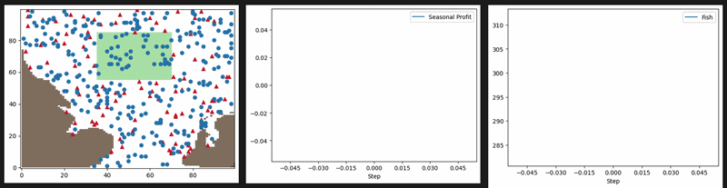

<div align="center">

# ABM_MSES

### Agent-Based Model — Dogger Bank Fisheries Management



---

[](https://www.python.org/)
[](https://mesa.readthedocs.io/)
[](https://solara.dev/)
[](LICENSE)

</div>

---

## Overview

This project implements an **Agent-Based Model (ABM)** of the Dogger Bank in the North Sea, developed as part of the Master of Science in Environmental Studies (MSES) program. The model simulates the interaction between a fish population and a fleet of fishing vessels under different spatial management policies — specifically the designation of the Dogger Bank as a Marine Protected Area (MPA).

The simulation runs on a 100 x 100 grid representing the North Sea. Land cells are derived from a real geographic overlay image (`static/north_sea_overlay.png`). Two agent types interact across the grid each time step:

- **Fish** — move toward a preferred location within the Dogger Bank, reproduce via logistic growth, and die at a density-dependent rate.
- **Fishers** — depart from a Dutch harbor, navigate toward productive fishing grounds using personal memory and social information, catch fish, and return to port when fuel or quota is exhausted.

---

## Model Description

### Agents

**Fish**

| Attribute | Value |
|-----------|-------|
| Preferred habitat | Dogger Bank (grid x: 35–69, y: 55–84) |
| Reproduction rate (inside Dogger Bank) | 0.002 per step |
| Reproduction rate (outside Dogger Bank) | 0.001 per step |
| Growth model | Logistic — suppressed as population approaches carrying capacity (`K = 3 * n_fish`) |
| Mortality | Density-dependent; increases with population ratio |

**Fishers**

| Attribute | Value |
|-----------|-------|
| Starting fuel | 5,000 – 10,000 units (randomised) |
| Fuel cost per step | 50 units |
| Max catch per step | 3 fish |
| Quota (TAK) | 20 fish per trip |
| Fish price | £10 per fish |
| Decision model | Personal memory map + social information from nearby successful fishers |
| Harbor location | Bottom-right coast (99, 0) — Netherlands |

### Policy Scenarios

| Scenario | `fish_policy` | Description |
|----------|---------------|-------------|
| MPA Protected | `True` (default) | Dogger Bank is a no-fishing zone; fishers are excluded from x: 35–69, y: 55–84 |
| Open Access | `False` | Fishers can access all water cells including the Dogger Bank |

### Key Parameters

| Parameter | Default | Description |
|-----------|---------|-------------|
| `n_fish` | 2,000 | Initial fish population |
| `n_fisher` | 50 | Number of fishing vessels |
| `width` / `height` | 100 | Grid dimensions |
| `fish_policy` | `True` | Enable Dogger Bank MPA |
| `FISH_CARRYING_CAPACITY` | `n_fish * 3` | Maximum sustainable fish population |
| `PERIOD_LENGTH` | 200 | Steps per season (used for profit reporting) |

### Data Collection

The model records the following metrics every step via Mesa's `DataCollector`:

| Reporter | Description |
|----------|-------------|
| `Fish` | Total fish population |
| `Step Catch` | Fish caught in the current step |
| `Seasonal Profit` | Cumulative fisher profit per 200-step season |
| `MSY` | Maximum Sustainable Yield reference |

---

## Repository Structure

```
ABM_MSES/
├── DoggerbankModel.py          # Core ABM — agents, model, Solara visualization
├── static/
│   ├── north_sea_overlay.png   # Geographic land mask (100x100 grid)
│   └── CanvasModule.js         # Custom JS canvas module
├── templates/
│   └── modular_template.html   # HTML template for the visualization
├── biggif.gif                  # Simulation demo GIF (shown above)
├── Github/                     # Additional media assets
└── README.md
```

---

## Installation

```bash
# 1. Clone the repository
git clone https://github.com/ingelevert/ABM_MSES.git
cd ABM_MSES

# 2. Create and activate a virtual environment
python -m venv venv
source venv/bin/activate        # Windows: venv\Scripts\activate

# 3. Install dependencies
pip install mesa solara pillow numpy
```

---

## Running the Model

Launch the interactive Solara visualization:

```bash
solara run DoggerbankModel.py
```

Then open [http://localhost:8765](http://localhost:8765) in your browser. The interface provides sliders to adjust the number of fish and fishers, and a toggle to enable or disable the Dogger Bank MPA.

---

## References

- Mesa ABM Framework: [https://mesa.readthedocs.io/](https://mesa.readthedocs.io/)
- Solara Visualization: [https://solara.dev/](https://solara.dev/)
- OSPAR Commission — Dogger Bank MPA: [https://www.ospar.org/](https://www.ospar.org/)

---

## License

This project is licensed under the [MIT License](LICENSE).

---

<div align="center">
  Developed as part of the MSES Program
</div>
